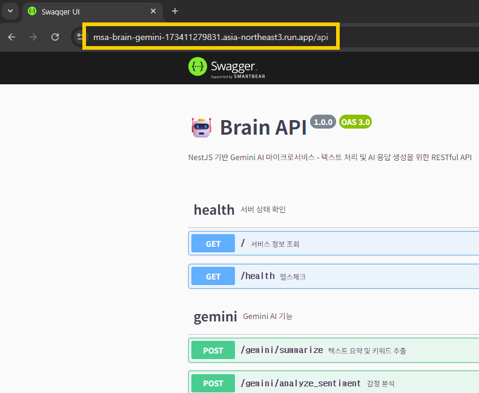
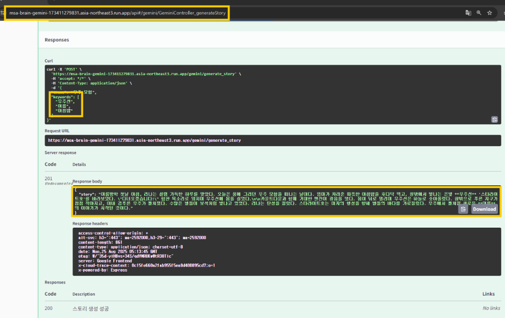
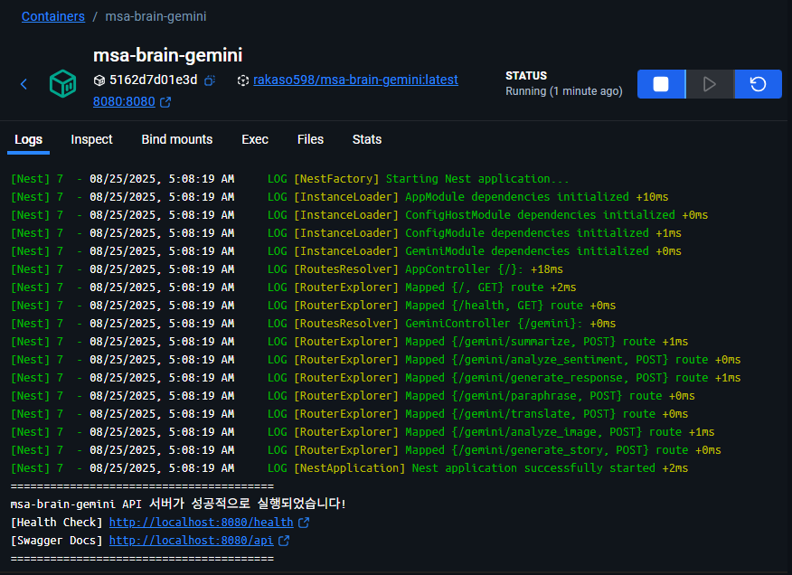
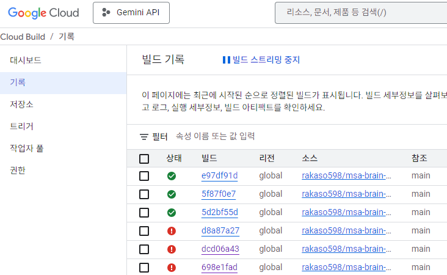
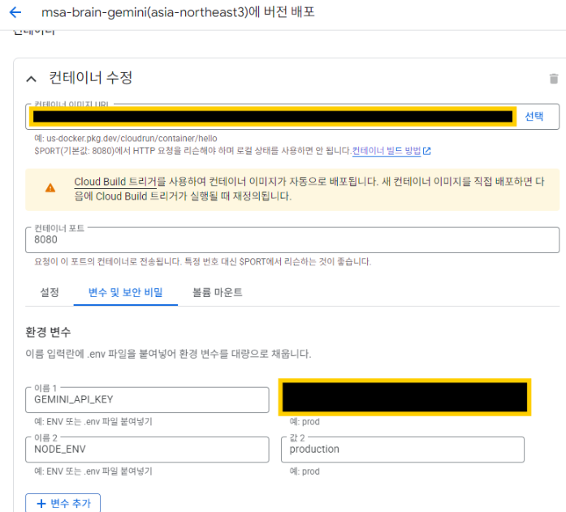
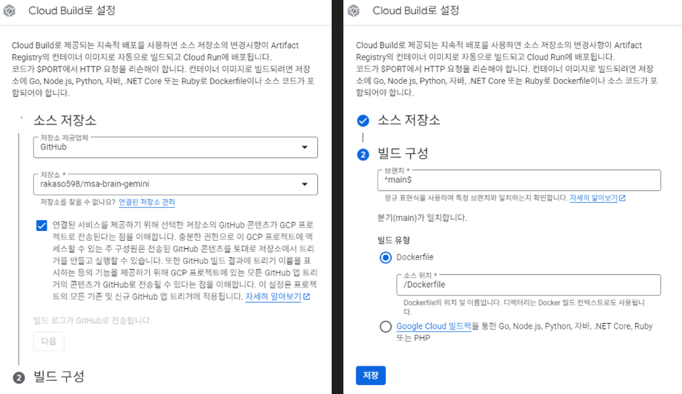
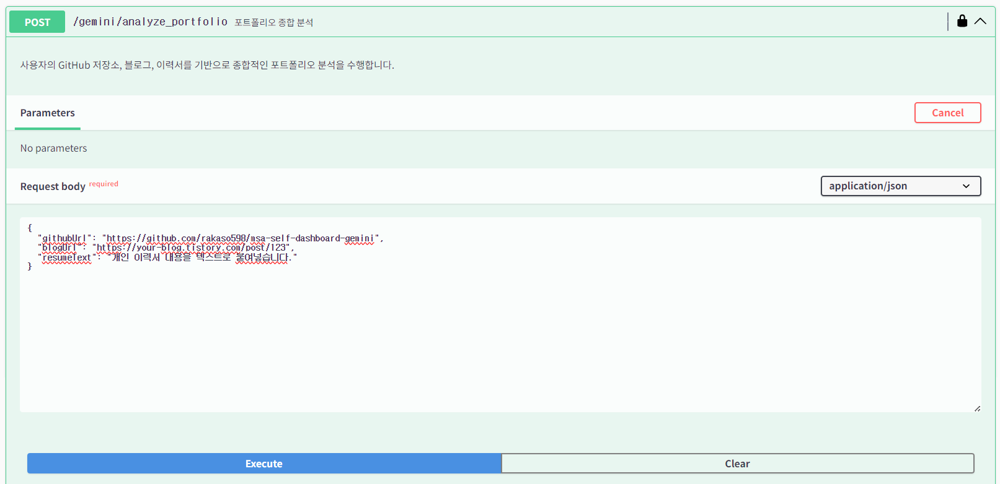
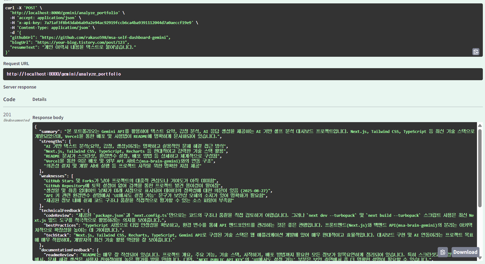

# MSA Brain Gemini - NestJS 기반 Gemini AI 마이크로서비스

## ✨ [GCP Cloud Run 배포 Swagger API 문서 바로가기](https://msa-brain-gemini-173411279831.asia-northeast3.run.app/api)

<details>
  <summary><h2>📜 GCP 배포 URL로 Swagger 문서 접속</h2></summary>
  
  
  
</details>

<details>
  <summary><h2>📖 배포 Swagger 문서에서 실제 API 요청 보내보기</h2></summary>
  
  
  
</details>

<details>
  <summary><h2>💿 Docker Desktop에서 배포할 이미지 실행시켜보기</h2></summary>
  
  
  
</details>

<details>
  <summary><h2>🧾 GCP에서 이미지 빌드 기록 보기</h2></summary>
  
  
  
</details>

<details>
  <summary><h2>☁️ GCP 배포 시 포트 및 환경변수 설정</h2></summary>
  
  
  
</details>

<details>
  <summary><h2>🧳 GCP 배포 시 GitHub 레포지토리와 연결하기</h2></summary>
  
  
  
</details>

<details>
  <summary><h2>💽 포트폴리오 종합 분석 API (GitHub PAT, Cheerio)</h2></summary>
  
  
  
</details>

<details>
  <summary><h2>🏹 포트폴리오 종합 분석 - 실제 요청 및 응답 (GitHub PAT, Cheerio)</h2></summary>
  
  
  
</details>

## 🚀 핵심 기능

- **문장 재구성 (Paraphrase)**: 입력 텍스트를 같은 의미로 다양한 표현으로 바꿔줍니다.
- **다국어 번역 (Translate)**: 텍스트를 원하는 언어로 번역합니다.
- **이미지 분석 (Analyze Image)**: 이미지를 업로드하고, 원하는 질문에 대해 AI가 이미지 내용을 분석해 답변합니다.
- **창의적 스토리 생성 (Generate Story)**: 주제와 키워드로 창의적인 짧은 이야기를 생성합니다.
- **텍스트 요약 및 키워드 추출**: 긴 텍스트를 3줄로 요약하고, 관련 키워드 3개를 추출합니다.
- **감정 분석**: 텍스트의 감정을 긍정/부정/중립으로 분류하고 이유를 설명합니다.
- **AI 응답 생성**: 자유로운 쿼리에 대해 도움이 되는 답변을 생성합니다.

## 🛡️ 보안 및 제한 사항

- **API 키 인증**: 모든 Gemini API 엔드포인트는 API 키 인증 필요
- **레이트 리미팅**: 무차별 대입 공격 및 과도한 사용 방지
  - 일반 API: 1분에 5개 요청
  - 고비용 작업(요약, AI응답, 이미지분석, 스토리생성): 1분에 2-3개 요청
  - 자세한 내용: [Rate Limiting 가이드](docs/RATE_LIMITING.md)

---

## 📡 API 엔드포인트 요약

| 메서드 | 엔드포인트                | 설명                       | 레이트 제한        |
|--------|---------------------------|----------------------------|--------------------|
| POST   | /gemini/summarize         | 텍스트 요약 및 키워드 추출 | 1분에 3개 요청     |
| POST   | /gemini/analyze_sentiment | 감정 분석                  | 1분에 5개 요청     |
| POST   | /gemini/generate_response | AI 응답 생성               | 1분에 3개 요청     |
| POST   | /gemini/paraphrase        | 문장 재구성                | 1분에 4개 요청     |
| POST   | /gemini/translate         | 다국어 번역                | 1분에 4개 요청     |
| POST   | /gemini/analyze_image     | 이미지 분석                | 1분에 2개 요청     |
| POST   | /gemini/generate_story    | 창의적 스토리 생성         | 1분에 2개 요청     |
| GET    | /health                   | 헬스체크                   | 제한 없음          |

---

## 🛠️ 빠른 시작

### 1. 환경 변수 설정

`.env` 파일에 아래와 같이 설정하세요:
```env
GEMINI_API_KEY=your_gemini_api_key_here
MY_API_KEY=your_secure_api_key_here
PORT=8000
NODE_ENV=production
```

> **⚠️ 보안 주의사항**: `MY_API_KEY`는 API 접근을 제어하는 중요한 키입니다. 강력한 키를 설정하고 외부에 노출되지 않도록 주의하세요.

### 2. Docker로 실행 (권장)

```bash
# 이미지 빌드
npm run docker:build
# 컨테이너 실행
npm run docker:run
```

### 3. 로컬 개발
```bash
npm install
npm run start:dev
```

---

## 📡 주요 API 예시

### 문장 재구성
```http
POST /gemini/paraphrase
Content-Type: application/json
{
  "text": "오늘은 날씨가 매우 좋습니다."
}
```

### 다국어 번역
```http
POST /gemini/translate
Content-Type: application/json
{
  "text": "안녕하세요. 오늘 날씨가 좋네요.",
  "targetLang": "English"
}
```

### 이미지 분석
```http
POST /gemini/analyze_image
Content-Type: multipart/form-data
image=<파일 업로드>, query="이 이미지에서 무엇을 볼 수 있나요?"
```

### 창의적 스토리 생성
```http
POST /gemini/generate_story
Content-Type: application/json
{
  "theme": "우주 모험",
  "keywords": ["우주선", "외계인", "모험"]
}
```

### 텍스트 요약
```http
POST /gemini/summarize
Content-Type: application/json
{
  "text": "요약할 텍스트 내용"
}
```

### 감정 분석
```http
POST /gemini/analyze_sentiment
Content-Type: application/json
{
  "text": "감정을 분석할 텍스트"
}
```

### AI 응답 생성
```http
POST /gemini/generate_response
Content-Type: application/json
{
  "text": "질문 또는 요청 내용"
}
```

### 헬스체크
```http
GET /health
```

---

---

## 🔐 API 인증

모든 Gemini API 엔드포인트는 API 키 인증이 필요합니다. 요청 시 헤더에 API 키를 포함해야 합니다.

### API 키 헤더 설정

```bash
# curl 사용 예시
curl -X POST "http://localhost:8000/gemini/summarize" \
  -H "Content-Type: application/json" \
  -H "x-api-key: your_secure_api_key_here" \
  -d '{"text": "요약할 텍스트를 입력하세요"}'
```

### Swagger UI에서 인증

1. [Swagger 문서](http://localhost:8000/api)에 접속
2. 우측 상단의 **Authorize** 버튼 클릭
3. API 키 입력 후 **Authorize** 클릭
4. 이제 모든 API를 테스트할 수 있습니다

### 인증이 필요하지 않은 엔드포인트

- `GET /` - 서비스 정보
- `GET /health` - 헬스체크

---

## 🏗️ 프로젝트 구조

```
/msa-brain-gemini
├── src/
│   ├── modules/
│   │   └── gemini/
│   │       ├── gemini.controller.ts
│   │       ├── gemini.module.ts
│   │       └── gemini.service.ts
│   ├── app.module.ts
│   └── main.ts
├── Dockerfile
├── docker-compose.yml
├── package.json
└── README.md
```

## 🛠️ 기술 스택

- **Framework**: NestJS
- **Language**: TypeScript
- **AI Service**: Google Gemini API
- **Container**: Docker
- **Package Manager**: npm

## 📝 개발 스크립트

```bash
npm run build       # 프로젝트 빌드
npm run start       # 애플리케이션 시작
npm run start:dev   # 개발 모드로 시작 (watch mode)
npm run start:prod  # 프로덕션 모드로 시작
npm run lint        # 코드 린팅
npm run test        # 테스트 실행
```

## 🔧 환경 설정

- **Node.js**: 18.x 이상
- **npm**: 8.x 이상
- **Gemini API Key**: Google AI Studio에서 발급

## 📞 문의

프로젝트에 대한 문의사항이나 버그 리포트는 이슈를 통해 남겨주세요.
